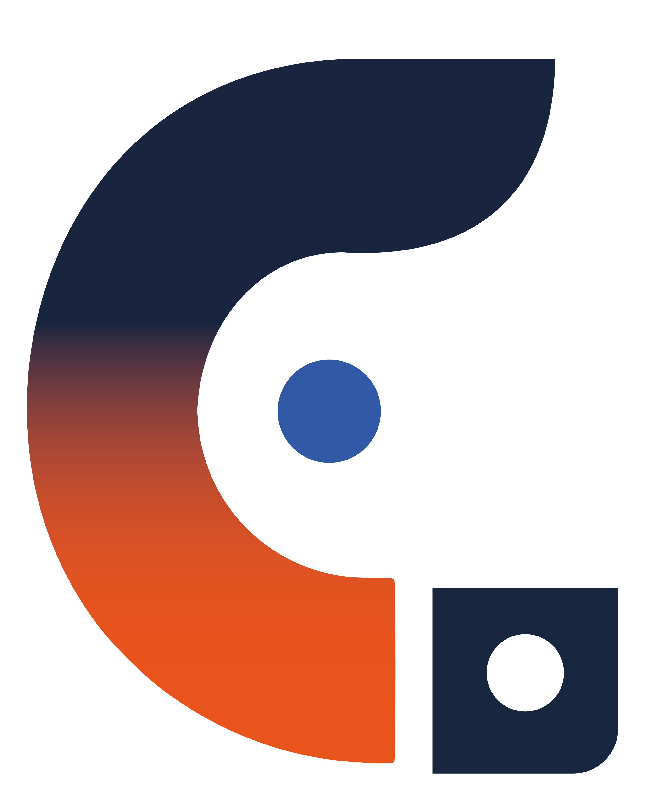

# Revisão didática — Currículo versão 4

## 1. Breve diagnóstico

A página já tinha conteúdo profissional organizado e dez interações. A revisão
preservou esses recursos, textos, fotografia e a identidade azul/laranja, com
ajustes localizados para clareza e acessibilidade.

- **Arquivos fragmentados:** duas folhas de estilo e nomes com sufixos dificultavam identificar a versão publicada. A entrega agora usa `index.html`, `style.css` e `script.js`.
- **Formulário incompleto:** campos de texto aceitavam apenas espaços; o botão “Enviar mensagem” podia sugerir envio direto. Agora há erros específicos por campo e indicação explícita de demonstração, sem servidor de envio.
- **Feedback e foco:** faltavam erros associados aos campos. Agora `aria-describedby` liga cada campo à sua explicação, `aria-invalid` identifica o erro e o foco vai para o primeiro campo inválido.
- **Estilos e dependências:** havia seletores antigos de navegação, regras repetidas, um listener de reset sem botão correspondente e uma biblioteca externa usada só para ícones. Esses trechos foram removidos ou consolidados.
- **Responsividade e contraste:** a regra genérica de botão sobrepunha a ocultação do contato no cabeçalho móvel. A especificidade foi corrigida. A paleta da versão 2 foi mantida, incluindo o laranja original nos textos e nos detalhes da marca.
- **Orientações de estudo:** os comentários agora apontam onde personalizar e como ampliar a página, sem explicar cada linha.

## 2. Código completo e revisado

Os três blocos abaixo são cópias integrais dos arquivos entregues, sem trechos
omitidos. Salve cada bloco com o nome indicado. Mantenha `Foto.png`,
`marca-camape.png` e `marca-camape-branca.png` na mesma pasta.

### index.html

```html
<!doctype html>
<!--
  CURRÍCULO — VERSÃO 4 | Guia de leitura para a aula
  1. O HTML descreve conteúdo, significado e controles nativos.
  2. style.css reúne apresentação, responsividade e estados interativos.
  3. script.js implementa dez recursos, identificados de 01 a 10.
  IDs identificam elementos únicos; classes agrupam elementos para estilização.
  Os comentários são material de estudo e não aparecem na página renderizada.
-->
<html lang="pt-BR">
  <head>
    <meta charset="utf-8" />
    <meta name="viewport" content="width=device-width, initial-scale=1" />
    <meta
      name="description"
      content="Currículo de Carlos Magno Pereira, professor e designer com atuação em educação e tecnologia."
    />
    <meta name="theme-color" content="#f4f1f2" />
    <meta name="color-scheme" content="light" />
    <title>
      Carlos Magno Pereira | Versão 4 · Professor · Designer · Profissional de TI
    </title>
    <link rel="icon" type="image/png" href="marca-camape-branca.png" />
    <link rel="stylesheet" href="style.css" />
    <!-- defer executa após a leitura do HTML, mantendo a ordem dos scripts. -->
    <script src="script.js" defer></script>
  </head>
  <body>
    <!-- JS 06: indicador visual decorativo; aria-hidden evita anunciar cada rolagem. -->
    <div id="progresso-leitura" aria-hidden="true"></div>
    <a class="skip-link" href="#conteudo-principal"
      >Pular para o conteúdo principal</a
    >

    <!-- Cabeçalho fixo: marca, navegação principal e menu para telas menores. -->
    <header class="cabecalho-site">
      <a
        class="marca-site"
        href="#inicio"
        aria-label="CAMAPE — voltar ao início"
      >
        
        <strong>CAMAPE</strong>
      </a>
      <nav class="menu-principal" aria-label="Navegação principal">
        <a href="#experiencia">Experiência</a>
        <a href="#formacao">Formação</a>
        <a href="#competencias">Competências</a>
        <a href="#portfolio">Portfólio</a>
      </nav>

      <!-- JS 01: details/summary já oferecem abertura nativa e acesso por teclado. -->
      <details class="menu-mobile">
        <summary
          class="menu-mobile-botao"
          aria-label="Abrir ou fechar menu de navegação"
        >
          <span aria-hidden="true"></span>
          <span aria-hidden="true"></span>
          <span aria-hidden="true"></span>
        </summary>
        <nav
          class="menu-mobile-lista"
          aria-label="Navegação para dispositivos móveis"
        >
          <a href="#experiencia">Experiência</a>
          <a href="#formacao">Formação</a>
          <a href="#competencias">Competências</a>
          <a href="#portfolio">Portfólio</a>
          <a href="#contato">Contato</a>
        </nav>
      </details>

      <a class="botao cabecalho-contato" href="#contato"
        >Contato <span aria-hidden="true">↓</span></a
      >
    </header>

    <main id="conteudo-principal" tabindex="-1">
      <!-- Apresentação principal e aplicação discreta da identidade visual CAMAPE. -->
      <section id="inicio" aria-labelledby="titulo-principal">
        <article>
          <p>
            <span aria-hidden="true"></span> Professor · Designer · Tecnologia
          </p>
          <h1 id="titulo-principal">
            <span>Carlos Magno</span><em>Pereira</em>
          </h1>
          <p class="hero-resumo">
            Transformo conhecimento em experiências de aprendizagem
            <strong>claras, acessíveis e significativas.</strong>
          </p>
          <p class="grupo-botoes">
            <a class="botao" href="#portfolio"
              >Conheça meu portfólio <span aria-hidden="true">↓</span></a
            >
            <a class="link-destaque" href="#contato"
              >Vamos conversar <span aria-hidden="true">↓</span></a
            >
          </p>
        </article>

        <!-- PERSONALIZE: substitua Foto.png e descreva a nova imagem no atributo alt. -->
        <aside aria-label="Foto profissional">
          <figure>
            
          </figure>
        </aside>
      </section>

      <!-- PERSONALIZE: edite o resumo e preserve a hierarquia h1 → h2 → h3 → h4. -->
      <section id="sobre" class="secao" aria-labelledby="titulo-sobre">
        <header class="secao-cabecalho">
          <span aria-hidden="true">01</span>
          <h2 id="titulo-sobre">Sobre</h2>
        </header>

        <article>
          <h3>
            Conecto repertório acadêmico a
            <em>desafios concretos de ensino.</em>
          </h3>
          <section class="sobre-textos" aria-label="Síntese profissional">
            <p>
              Professor com atuação no ensino superior e técnico, experiência em
              Design, Tecnologia da Informação, Engenharias, Marketing e
              Pedagogia. Planejo e conduzo experiências de aprendizagem
              presenciais, híbridas e EAD.
            </p>
            <p>
              Aplico metodologias ativas, comunicação clara e pensamento visual
              para estruturar conteúdos, estimular a participação e desenvolver
              competências técnicas e socioemocionais.
            </p>
          </section>
          <blockquote>
            “Ensinar é projetar caminhos para que cada estudante construa o
            próprio conhecimento.”
          </blockquote>
        </article>
      </section>

      <!-- PERSONALIZE: duplique um li completo para incluir outra experiência. -->
      <section
        id="experiencia"
        class="secao secao-escura"
        aria-labelledby="titulo-experiencia"
      >
        <header class="secao-cabecalho">
          <span aria-hidden="true">02</span>
          <h2 id="titulo-experiencia">Experiência</h2>
        </header>

        <section class="secao-conteudo" aria-labelledby="titulo-trajetoria">
          <header class="secao-introducao">
            <h3 id="titulo-trajetoria">
              Trajetória<br /><em>profissional</em>
            </h3>
            <p>
              Atuação construída entre sala de aula, ambientes digitais,
              produção de conteúdo e projetos reais.
            </p>
          </header>

          <ol class="trajetoria-lista">
            <li>
              <article class="experiencia-card">
                <span class="item-numero" aria-hidden="true">01</span>
                <time datetime="2018-03">03/2018 — atual</time>
                <section>
                  <h4>Faculdade UNA Pouso Alegre · Grupo Ânima</h4>
                  <p class="experiencia-cargo">Docente</p>
                  <p>
                    Ensino superior em Design, TI, Engenharias, Marketing e
                    áreas correlatas, nos formatos presencial, híbrido e EAD.
                  </p>
                  <ul class="etiquetas">
                    <li>Materiais e trilhas de aprendizagem</li>
                    <li>PBL e avaliação por competências</li>
                    <li>CPA, NDE, Colegiado e MEC</li>
                  </ul>
                </section>
              </article>
            </li>
            <li>
              <article class="experiencia-card">
                <span class="item-numero" aria-hidden="true">02</span>
                <time datetime="2025-06">06/2025 — 01/2026</time>
                <section>
                  <h4>UFU · Educação Midiática</h4>
                  <p class="experiencia-cargo">
                    Tutor | Mediação e Experiência de Aprendizagem
                  </p>
                  <p>
                    Mediação ativa em ambiente digital, estímulo ao pensamento
                    crítico, estratégias colaborativas e feedback formativo.
                  </p>
                </section>
              </article>
            </li>
            <li>
              <article class="experiencia-card">
                <span class="item-numero" aria-hidden="true">03</span>
                <time datetime="2025-04">04/2025 — 10/2025</time>
                <section>
                  <h4>Evoluir Educação</h4>
                  <p class="experiencia-cargo">
                    Facilitador · Conteúdos Digitais
                  </p>
                  <p>
                    Planejamento de conteúdos educacionais, aplicação de
                    ferramentas multimídia e suporte à aprendizagem.
                  </p>
                </section>
              </article>
            </li>
            <li>
              <article class="experiencia-card">
                <span class="item-numero" aria-hidden="true">04</span>
                <time datetime="2021-11">11/2021 — 03/2025</time>
                <section>
                  <h4>IFSULDEMINAS · Campus Machado</h4>
                  <p class="experiencia-cargo">Professor substituto</p>
                  <p>
                    Informática, Programação, Gestão de Sistemas e Sistemas de
                    Informação.
                  </p>
                  <ul class="etiquetas">
                    <li>Materiais didáticos</li>
                    <li>Projetos integradores</li>
                    <li>Planejamento de aulas</li>
                  </ul>
                </section>
              </article>
            </li>
            <li>
              <article class="experiencia-card">
                <span class="item-numero" aria-hidden="true">05</span>
                <time datetime="2021-11">11/2021 — 03/2025</time>
                <section>
                  <h4>SENAC MG</h4>
                  <p class="experiencia-cargo">Instrutor de cursos</p>
                  <p>
                    Cursos técnicos de TI, Marketing, Administração e Vendas,
                    conectando aulas teóricas, práticas e projetos integradores.
                  </p>
                  <ul class="etiquetas">
                    <li>Materiais didáticos</li>
                    <li>Projetos integradores</li>
                    <li>Competências socioemocionais</li>
                  </ul>
                </section>
              </article>
            </li>
            <li>
              <article class="experiencia-card">
                <span class="item-numero" aria-hidden="true">06</span>
                <time datetime="2024-01">01/2024 — 02/2024</time>
                <section>
                  <h4>UNIFECAF</h4>
                  <p class="experiencia-cargo">
                    UX Writing &amp; Design de Conteúdo
                  </p>
                  <p>
                    Materiais didáticos, roteiros educacionais, videoaulas e
                    adequação de linguagem para diferentes estudantes.
                  </p>
                </section>
              </article>
            </li>
            <li>
              <article class="experiencia-card">
                <span class="item-numero" aria-hidden="true">07</span>
                <time datetime="2023-06">06/2023 — 09/2023</time>
                <section>
                  <h4>IFSULDEMINAS</h4>
                  <p class="experiencia-cargo">
                    Diagramador, conteudista e instrutor EAD
                  </p>
                  <p>
                    Estruturação visual e pedagógica de conteúdos, materiais
                    digitais e aulas para o curso EAD de Fotógrafo.
                  </p>
                </section>
              </article>
            </li>
          </ol>
        </section>
      </section>

      <!-- Formação acadêmica e graduações. -->
      <section id="formacao" class="secao" aria-labelledby="titulo-formacao">
        <header class="secao-cabecalho">
          <span aria-hidden="true">03</span>
          <h2 id="titulo-formacao">Formação</h2>
        </header>

        <section class="secao-conteudo" aria-labelledby="titulo-percurso">
          <header class="secao-introducao">
            <h3 id="titulo-percurso">Aprender<br /><em>sempre</em></h3>
            <p>
              Percurso acadêmico multidisciplinar, da docência ao
              desenvolvimento de soluções e linguagens visuais.
            </p>
          </header>

          <ol class="formacao-lista">
            <li>
              <article>
                <span>Mestrado</span>
                <section>
                  <h4>Desenvolvimento, Tecnologias e Sociedade</h4>
                  <p>UNIFEI · 2015—2017</p>
                </section>
              </article>
            </li>
            <li>
              <article>
                <span>Pós-graduação</span>
                <section>
                  <h4>Tecnologias Educacionais</h4>
                  <p>Faculdade Paulistana · em finalização</p>
                </section>
              </article>
            </li>
            <li>
              <article>
                <span>Pós-graduação</span>
                <section>
                  <h4>Futuros Acadêmicos e Currículos Integrados</h4>
                  <p>Anhembi Morumbi · em finalização</p>
                </section>
              </article>
            </li>
            <li>
              <article>
                <span>Pós-graduação</span>
                <section>
                  <h4>Design Instrucional e Pedagogia do E-learning</h4>
                  <p>Cruzeiro do Sul · 2024—2025</p>
                </section>
              </article>
            </li>
            <li>
              <article>
                <span>Pós-graduação</span>
                <section>
                  <h4>Growth Hacking &amp; Agile Mindset</h4>
                  <p>HSM · 2021—2022</p>
                </section>
              </article>
            </li>
          </ol>

          <aside class="lista-complementar">
            <h4>Graduações</h4>
            <ul>
              <li>Pedagogia · Licenciatura · 2026</li>
              <li>Design Gráfico · Tecnólogo · 2024—2025</li>
              <li>Análise e Desenvolvimento de Sistemas · 2021—2022</li>
              <li>Artes Visuais · Licenciatura · 2022</li>
              <li>Design de Ambientes · Bacharelado · 2009—2014</li>
            </ul>
          </aside>
        </section>
      </section>

      <!-- Competências principais e formação complementar. -->
      <section
        id="competencias"
        class="secao"
        aria-labelledby="titulo-competencias"
      >
        <header class="secao-cabecalho">
          <span aria-hidden="true">04</span>
          <h2 id="titulo-competencias">Competências</h2>
        </header>

        <section class="secao-conteudo" aria-labelledby="titulo-conexoes">
          <header class="secao-introducao">
            <h3 id="titulo-conexoes">O que eu<br /><em>conecto</em></h3>
            <p>
              Saberes complementares aplicados ao planejamento, à mediação, à
              comunicação e à produção digital.
            </p>
          </header>

          <ul class="competencias-lista">
            <li>
              <article class="competencia-card">
                <span class="item-numero" aria-hidden="true">01</span>
                <span class="competencia-icone" aria-hidden="true">✦</span>
                <h4>Pedagogia</h4>
                <ul>
                  <li>Planejamento de ensino</li>
                  <li>Metodologias ativas</li>
                  <li>Avaliação por competências</li>
                  <li>Mediação da aprendizagem</li>
                </ul>
              </article>
            </li>
            <li>
              <article class="competencia-card">
                <span class="item-numero" aria-hidden="true">02</span>
                <span class="competencia-icone" aria-hidden="true">◎</span>
                <h4>Learning Experience</h4>
                <ul>
                  <li>Design instrucional</li>
                  <li>Trilhas de aprendizagem</li>
                  <li>PBL e STEAM</li>
                  <li>Conteúdo educacional digital</li>
                </ul>
              </article>
            </li>
            <li>
              <article class="competencia-card">
                <span class="item-numero" aria-hidden="true">03</span>
                <span class="competencia-icone" aria-hidden="true">⌘</span>
                <h4>Tecnologia</h4>
                <ul>
                  <li>Ambientes virtuais de aprendizagem</li>
                  <li>HTML, CSS e JavaScript</li>
                  <li>Figma, Canva e Adobe</li>
                  <li>Produção multimídia</li>
                </ul>
              </article>
            </li>
            <li>
              <article class="competencia-card">
                <span class="item-numero" aria-hidden="true">04</span>
                <span class="competencia-icone" aria-hidden="true">◇</span>
                <h4>UX &amp; Comunicação</h4>
                <ul>
                  <li>Jornadas e fluxos</li>
                  <li>Pesquisa e validação</li>
                  <li>Storytelling</li>
                  <li>Organização e diagramação</li>
                </ul>
              </article>
            </li>
          </ul>

          <aside class="lista-complementar">
            <h4>Formação complementar</h4>
            <ul>
              <li>Educação Midiática · UFU · 2025—2026</li>
              <li>Figma · EBAC · 2024</li>
              <li>Docência e Tutoria EaD · IFRS · 2025</li>
              <li>Criação de Videoaulas na EaD · IFRS · 2025</li>
              <li>Ensino e Aprendizagem na EaD · IFRS · 2025</li>
              <li>
                Apoio educacional a estudantes com deficiências · IFSULDEMINAS ·
                2024
              </li>
              <li>Mediação Pedagógica On-line · IFRS · 2025</li>
            </ul>
          </aside>
        </section>
      </section>

      <!-- PERSONALIZE: duplique um li da lista; mantenha article, h4, p e a para busca/modal. -->
      <section
        id="portfolio"
        class="secao secao-escura"
        aria-labelledby="titulo-portfolio"
      >
        <header class="secao-cabecalho">
          <span aria-hidden="true">05</span>
          <h2 id="titulo-portfolio">Portfólio</h2>
        </header>

        <section class="secao-conteudo" aria-labelledby="titulo-projetos">
          <header class="secao-introducao">
            <h3 id="titulo-projetos">
              Projetos que unem<br /><em>ideia e prática</em>
            </h3>
            <p>
              Uma seleção de trabalhos em design educacional, conteúdo,
              interfaces e pesquisa aplicada.
            </p>
          </header>

          <!-- JS 07: input filtra os cartões; role=status anuncia o resultado da busca. -->
          <div class="busca-portfolio recurso-js">
            <label for="busca-projeto">Buscar no portfólio</label>
            <input id="busca-projeto" type="search" placeholder="Digite um tema, como pesquisa…" aria-controls="lista-projetos" />
            <p id="resultado-busca" role="status"></p>
          </div>
          <ul class="portfolio-lista" id="lista-projetos">
            <li>
              <article class="projeto-card">
                <span class="item-numero" aria-hidden="true">01</span>
                <figure>
                  <span aria-hidden="true">✦</span>
                  <figcaption>Aprendizagem em movimento</figcaption>
                </figure>
                <h4>Design educacional</h4>
                <p>
                  Trilhas de aprendizagem, materiais didáticos e experiências
                  para ambientes presenciais, híbridos e digitais.
                </p>
                <a
                  href="https://www.behance.net/gallery/246209709/Design-Instrucional-Aplicado-ao-Ensino-de-Interface"
                  target="_blank"
                  rel="noopener noreferrer"
                >
                  Ver projetos educacionais <span aria-hidden="true">↗</span
                  ><span class="sr-only"> (abre em nova aba)</span>
                </a>
              </article>
            </li>
            <li>
              <article class="projeto-card">
                <span class="item-numero" aria-hidden="true">02</span>
                <figure>
                  <span aria-hidden="true">◫</span>
                  <figcaption>Conteúdo que ganha forma</figcaption>
                </figure>
                <h4>Conteúdo &amp; comunicação</h4>
                <p>
                  Diagramação, roteiros, produção visual e storytelling para
                  tornar conteúdos complexos mais claros e acessíveis.
                </p>
                <a
                  href="https://www.behance.net/gallery/239738657/Design-instrucional-e-educacional-diagramacao"
                  target="_blank"
                  rel="noopener noreferrer"
                >
                  Ver projetos de conteúdo <span aria-hidden="true">↗</span
                  ><span class="sr-only"> (abre em nova aba)</span>
                </a>
              </article>
            </li>
            <li>
              <article class="projeto-card">
                <span class="item-numero" aria-hidden="true">03</span>
                <figure>
                  <span aria-hidden="true">⌘</span>
                  <figcaption>Experiências conectadas</figcaption>
                </figure>
                <h4>Tecnologia &amp; experiência</h4>
                <p>
                  Interfaces, jornadas digitais e soluções que aproximam
                  pessoas, informação e aprendizagem.
                </p>
                <a
                  href="https://medium.com/@carloscamape/orbis-projetando-uma-plataforma-acad%C3%AAmica-de-eventos-e-publica%C3%A7%C3%B5es-cient%C3%ADficas-4131d86c61a4"
                  target="_blank"
                  rel="noopener noreferrer"
                >
                  Acessar projeto de UX <span aria-hidden="true">↗</span
                  ><span class="sr-only"> (abre em nova aba)</span>
                </a>
              </article>
            </li>
            <li>
              <article class="projeto-card">
                <span class="item-numero" aria-hidden="true">04</span>
                <figure>
                  <span aria-hidden="true">◎</span>
                  <figcaption>Pesquisa que orienta</figcaption>
                </figure>
                <h4>Pesquisa &amp; estratégia</h4>
                <p>
                  Investigação de necessidades, estruturação de jornadas e
                  decisões orientadas à experiência dos usuários.
                </p>
                <a
                  href="https://medium.com/@carloscamape/transformando-pesquisa-em-estrat%C3%A9gia-personas-jornada-do-usu%C3%A1rio-e-oportunidades-de-design-a30636a00e10"
                  target="_blank"
                  rel="noopener noreferrer"
                >
                  Acessar estudo completo <span aria-hidden="true">↗</span
                  ><span class="sr-only"> (abre em nova aba)</span>
                </a>
              </article>
            </li>
          </ul>

          <aside class="portfolio-cta">
            <p>Veja outros trabalhos, estudos visuais e projetos publicados.</p>
            <a
              href="https://www.behance.net/carloscamape1"
              target="_blank"
              rel="noopener noreferrer"
            >
              Acessar portfólio completo <span aria-hidden="true">↗</span
              ><span class="sr-only"> (abre em nova aba)</span>
            </a>
          </aside>
        </section>
      </section>

      <!-- Formulário e canais profissionais de contato. -->
      <section id="contato" class="secao" aria-labelledby="titulo-contato">
        <header class="secao-cabecalho">
          <span aria-hidden="true">06</span>
          <h2 id="titulo-contato">Contato</h2>
        </header>

        <section class="secao-conteudo" aria-labelledby="titulo-conversa">
          <header class="secao-introducao">
            <h3 id="titulo-conversa">
              Vamos criar algo<br /><em>significativo?</em>
            </h3>
            <p>
              Estou disponível para projetos educacionais, docência, design de
              aprendizagem e colaborações.
            </p>
          </header>

          <div class="contato-grade">
            <!-- JS 05: name é a chave do FormData; required/type/maxlength validam os campos. -->
            <!-- DEMONSTRAÇÃO: valida no navegador e prepara um mailto, sem servidor de envio. -->
            <form
              id="form-contato"
              action="mailto:carloscamape@gmail.com"
              method="post"
              enctype="text/plain"
              aria-describedby="aviso-formulario"
            >
              <fieldset>
                <legend>Prepare uma mensagem</legend>
                <p id="aviso-formulario">
                  Demonstração de formulário: os campos são validados no navegador.
                  O site não envia nem armazena mensagens. Ao final, você poderá
                  abrir um rascunho no seu aplicativo de e-mail.
                </p>
                <div class="formulario-campos">
                  <p>
                    <label for="nome">Nome</label>
                    <input
                      id="nome" aria-describedby="erro-nome"
                      type="text"
                      name="nome"
                      maxlength="100"
                      autocomplete="name"
                      placeholder="Como você se chama?"
                      required
                    />
                    <small id="erro-nome" class="erro-campo" hidden></small>
                  </p>
                  <p>
                    <label for="email">E-mail</label>
                    <input
                      id="email" aria-describedby="erro-email"
                      type="email"
                      name="email"
                      maxlength="254"
                      autocomplete="email"
                      placeholder="voce@exemplo.com"
                      required
                    />
                    <small id="erro-email" class="erro-campo" hidden></small>
                  </p>
                  <p class="campo-assunto">
                    <label for="assunto">Assunto</label>
                    <select id="assunto" aria-describedby="erro-assunto" name="assunto" required>
                      <option value="" selected disabled>
                        Selecione uma opção
                      </option>
                      <option>Oportunidade docente</option>
                      <option>Projeto educacional</option>
                      <option>Design e tecnologia</option>
                      <option>Outro assunto</option>
                    </select>
                    <small id="erro-assunto" class="erro-campo" hidden></small>
                  </p>
                  <p class="campo-mensagem">
                    <label for="mensagem">Mensagem</label>
                    <textarea
                      id="mensagem"
                      aria-describedby="erro-mensagem contador-mensagem"
                      name="mensagem"
                      rows="7"
                      maxlength="2000"
                      placeholder="Conte um pouco sobre a oportunidade ou o projeto."
                      required
                    ></textarea>
                    <small id="erro-mensagem" class="erro-campo" hidden></small>
                    <!-- JS 09: aria-describedby associa esta ajuda ao textarea. -->
                    <small id="contador-mensagem" class="recurso-js"></small>
                  </p>
                </div>
                <button class="botao" type="submit" disabled>
                  Preparar e-mail <span aria-hidden="true">↗</span>
                </button>
                <noscript>Ative o JavaScript para usar a demonstração ou utilize os canais de contato.</noscript>
                <a id="abrir-rascunho" class="botao" hidden>Abrir rascunho no aplicativo de e-mail</a>
                <p
                  id="feedback-formulario"
                  class="feedback-formulario"
                  role="status"
                  aria-live="polite"
                  hidden
                ></p>

              </fieldset>
            </form>

            <aside class="canais-contato">
              <h4>Canais disponíveis</h4>
              <p>
                Se preferir, entre em contato diretamente por um destes canais.
              </p>
              <address>
                <!-- PERSONALIZE: ao trocar o e-mail, atualize também action do formulário. -->
                <a href="mailto:carloscamape@gmail.com">
                  <b aria-hidden="true">✉</b>
                  <span>carloscamape@gmail.com</span>
                </a>
                <a
                  href="https://wa.me/5535997002032"
                  target="_blank"
                  rel="noopener noreferrer"
                >
                  <b aria-hidden="true">W</b>
                  <span>+55 35 99700-2032</span>
                  <span class="indicador-externo" aria-hidden="true">↗</span>
                  <span class="sr-only"> (abre em nova aba)</span>
                </a>
                <a
                  href="https://www.linkedin.com/in/carloscamape/"
                  target="_blank"
                  rel="noopener noreferrer"
                >
                  <b aria-hidden="true">in</b>
                  <span>LinkedIn</span>
                  <span class="indicador-externo" aria-hidden="true">↗</span>
                  <span class="sr-only"> (abre em nova aba)</span>
                </a>
                <a
                  href="https://www.instagram.com/carloscamape/"
                  target="_blank"
                  rel="noopener noreferrer"
                >
                  <b aria-hidden="true">◎</b>
                  <span>Instagram</span>
                  <span class="indicador-externo" aria-hidden="true">↗</span>
                  <span class="sr-only"> (abre em nova aba)</span>
                </a>
                <!--
                  LINK DO LATTES: substitua apenas o valor de href abaixo
                  pelo endereço completo do currículo que deseja divulgar.
                  O endereço já preenchido foi preservado da versão anterior.
                -->
                <a
                  id="link-lattes"
                  href="http://lattes.cnpq.br/3609242107296023"
                  target="_blank"
                  rel="noopener noreferrer"
                >
                  <b aria-hidden="true">⌘</b>
                  <span>Currículo Lattes</span>
                  <span class="indicador-externo" aria-hidden="true">↗</span>
                  <span class="sr-only"> (abre em nova aba)</span>
                </a>
              </address>
              <!-- JS 10: type=button evita uma submissão acidental de formulário. -->
              <button class="botao recurso-js" id="copiar-email" type="button">Copiar e-mail</button>
              <p id="feedback-copia" role="status"></p>
            </aside>
          </div>
        </section>
      </section>
      <!-- CRIE UMA SEÇÃO: use section com id único e h2; inclua um link nos menus.
           Reutilize .secao e .secao-cabecalho para manter o padrão visual. -->
    </main>

    <!-- Atalho persistente para retornar ao início da página. -->
    <a class="voltar-topo" href="#inicio" aria-label="Voltar ao início">↑</a>

    <!-- Rodapé com navegação complementar. -->
    <footer>
      <nav aria-label="Navegação complementar">
        <a href="#sobre">Sobre</a>
        <a href="#experiencia">Experiência</a>
        <a href="#formacao">Formação</a>
        <a href="#contato">Contato</a>
      </nav>
      <p>
        © <span data-ano>2026</span> · Desenvolvido por Carlos Magno Pereira
      </p>
    </footer>
    <!-- JS 08: dialog oferece fechamento por Escape e controle nativo do foco. -->
    <dialog id="detalhes-projeto" aria-labelledby="titulo-modal">
      <form method="dialog">
        <button class="botao" type="submit" autofocus>Fechar detalhes ×</button>
      </form>
      <h2 id="titulo-modal">Detalhes do projeto</h2>
      <p id="texto-modal"></p>
      <a id="link-modal" class="botao" target="_blank" rel="noopener noreferrer">Acessar trabalho ↗ (nova aba)</a>
    </dialog>
  </body>
</html>
```

### style.css

```css
/* CURRÍCULO V4 — STYLE.CSS
   PERSONALIZE: altere as variáveis em :root; mantenha contraste entre texto e fundo.
   Organização: base → componentes/seções → interações → responsividade → impressão.
   rem acompanha o tamanho de fonte do navegador; clamp limita tamanhos fluidos. */
/* 01. Configurações e base
   Paleta oficial: #1E2648, #33456E, #1AABE3, #EC621C, #F2925A, #959AAF e #F4F1F2. */
:root {
  --navy: #1e2648;
  --blue: #33456e;
  --brand-orange: #ec621c;
  --cyan: #1aabe3;
  --orange: #ec621c; /* Laranja original da versão 2. */
  --error: var(--blue); /* Erros usam a paleta original e mensagens explícitas. */
  --field-border: var(--line); /* Borda original da versão 2. */
  --print-ink: #000000;
  --orange-light: #f2925a;
  --paper: #f4f1f2;
  --white: #ffffff;
  --line: rgb(51 69 110 / 22%);
  --shadow: 0 0.875rem 1.875rem rgb(30 38 72 / 12%);
  --radius: 0.25rem;
  --content-width: 75rem;
  --transition: 180ms ease;
}

*,
*::before,
*::after {
  box-sizing: border-box;
}

html {
  scroll-behavior: smooth;
  scroll-padding-top: 5.5rem;
}

body {
  margin: 0;
  overflow-wrap: anywhere;
  background: var(--paper);
  color: var(--navy);
  font-family: Inter, "Segoe UI", Roboto, Helvetica, Arial, sans-serif;
  font-size: 1rem;
  line-height: 1.6;
}

main:focus {
  outline: 0;
}

a {
  color: inherit;
  text-decoration: none;
}

button,
input,
select,
textarea {
  font: inherit;
}

button {
  cursor: pointer;
}

img {
  display: block;
  max-width: 100%;
  height: auto;
}

h1,
h2,
h3,
h4,
p,
figure,
blockquote {
  margin-top: 0;
}

h1,
h2,
h3,
h4 {
  line-height: 1.12;
  text-wrap: balance;
}

ul[class],
ol[class] {
  margin: 0;
  padding: 0;
  list-style: none;
}

::selection {
  background: var(--cyan);
  color: var(--navy);
}

:is(a, summary, button, input, select, textarea):focus-visible {
  outline: 0.1875rem solid var(--white);
  outline-offset: 0.1875rem;
  box-shadow: 0 0 0 0.375rem var(--navy);
}

.sr-only {
  position: absolute;
  width: 1px;
  height: 1px;
  padding: 0;
  overflow: hidden;
  clip: rect(0, 0, 0, 0);
  white-space: nowrap;
  border: 0;
}

.skip-link {
  position: fixed;
  z-index: 100;
  top: 0.75rem;
  left: 0.75rem;
  padding: 0.75rem 1rem;
  border-radius: var(--radius);
  background: var(--navy);
  color: var(--white);
  font-size: 0.8rem;
  font-weight: 700;
  transform: translateY(-200%);
  transition: transform var(--transition);
}

.skip-link:focus {
  transform: translateY(0);
}

/* 02. Cabeçalho e navegação */
.cabecalho-site {
  position: fixed;
  z-index: 20;
  top: 0;
  left: 0;
  width: 100%;
  min-height: 4.5rem;
  display: flex;
  align-items: center;
  justify-content: space-between;
  gap: 1rem;
  padding: 0.75rem clamp(1rem, 4vw, 3.75rem);
  border-bottom: 1px solid var(--line);
  background: rgb(244 241 242 / 94%);
  box-shadow: 0 0.25rem 1.125rem rgb(30 38 72 / 5%);
  backdrop-filter: blur(0.75rem);
}

.marca-site {
  display: inline-flex;
  align-items: center;
  gap: 0.625rem;
  font-size: 0.75rem;
  font-weight: 800;
  letter-spacing: 0.12em;
}

.marca-site img {
  width: 2.625rem;
  height: 2.625rem;
  object-fit: contain;
  transition: transform var(--transition);
}

.menu-principal,
.cabecalho-site .cabecalho-contato {
  display: none;
}

.menu-mobile {
  position: relative;
  margin-left: auto;
}

.menu-mobile-botao {
  display: grid;
  align-content: center;
  width: 2.75rem;
  aspect-ratio: 1;
  gap: 0.3125rem;
  padding: 0.625rem;
  border: 1px solid var(--line);
  border-radius: 50%;
  cursor: pointer;
  list-style: none;
}

.menu-mobile-botao::-webkit-details-marker {
  display: none;
}

.menu-mobile-botao span {
  width: 100%;
  height: 0.125rem;
  background: var(--blue);
  transition:
    transform var(--transition),
    opacity var(--transition);
}

.menu-mobile[open] .menu-mobile-botao span:first-child {
  transform: translateY(0.4375rem) rotate(45deg);
}

.menu-mobile[open] .menu-mobile-botao span:nth-child(2) {
  opacity: 0;
}

.menu-mobile[open] .menu-mobile-botao span:last-child {
  transform: translateY(-0.4375rem) rotate(-45deg);
}

.menu-mobile-lista {
  position: absolute;
  z-index: 30;
  top: 3.5rem;
  right: 0;
  display: grid;
  width: min(18rem, 82vw);
  max-height: calc(100vh - 6rem);
  overflow-y: auto;
  padding: 0.875rem;
  border: 1px solid var(--line);
  border-top: 0.1875rem solid var(--brand-orange);
  border-radius: var(--radius);
  background: var(--paper);
  box-shadow: var(--shadow);
}

.menu-mobile-lista a {
  display: flex;
  align-items: center;
  min-height: 2.75rem;
  padding: 0.75rem 0.625rem;
  border-bottom: 1px solid var(--line);
  color: var(--blue);
  font-size: 0.8rem;
  font-weight: 700;
}

.menu-mobile-lista a:last-child {
  border-bottom: 0;
  color: var(--orange);
}

.menu-mobile-lista a[aria-current="location"] {
  color: var(--orange);
  background: rgb(51 69 110 / 5%);
}

/* 03. Componentes compartilhados */
.botao {
  min-height: 2.875rem;
  display: inline-flex;
  align-items: center;
  justify-content: center;
  gap: 0.5rem;
  padding: 0.75rem 1.125rem;
  border: 0;
  border-radius: var(--radius);
  background: var(--navy);
  color: var(--white);
  font-size: 0.78rem;
  font-weight: 750;
  line-height: 1.2;
  text-align: center;
  box-shadow: inset 0 -0.1875rem var(--brand-orange);
  transition:
    background var(--transition),
    transform var(--transition),
    box-shadow var(--transition);
}

.link-destaque,
.projeto-card > a,
.portfolio-cta > a {
  display: inline-flex;
  align-items: center;
  gap: 0.35rem;
  padding-bottom: 0.25rem;
  border-bottom: 0.125rem solid var(--orange);
  font-size: 0.78rem;
  font-weight: 750;
  transition:
    color var(--transition),
    border-color var(--transition),
    transform var(--transition);
}

.botao:active,
.voltar-topo:active {
  transform: translateY(0.0625rem);
}

.link-destaque:active,
.projeto-card > a:active,
.portfolio-cta > a:active {
  color: var(--orange);
}

.secao {
  position: relative;
  display: grid;
  gap: 2rem;
  padding: clamp(3.5rem, 9vw, 6.5rem) clamp(1.125rem, 5vw, 4.5rem);
  scroll-margin-top: 5rem;
}

.secao-cabecalho {
  display: flex;
  align-items: center;
  gap: 0.75rem;
}

.secao-cabecalho > span,
.item-numero {
  color: var(--orange);
  font-size: 0.75rem;
  font-weight: 800;
  letter-spacing: 0.12em;
}

.secao-cabecalho h2 {
  margin: 0;
  color: var(--blue);
  font-size: 0.78rem;
  letter-spacing: 0.14em;
  text-transform: uppercase;
}

.secao-conteudo,
#sobre > article {
  width: min(100%, var(--content-width));
}

.secao-introducao {
  display: grid;
  gap: 1rem;
  margin-bottom: clamp(2rem, 6vw, 3.75rem);
}

.secao-introducao h3,
#sobre > article > h3 {
  margin-bottom: 0;
  color: var(--blue);
  font-size: clamp(2rem, 8vw, 3.75rem);
  letter-spacing: -0.045em;
}

.secao-introducao h3 em,
#sobre > article > h3 em {
  color: var(--orange);
  font-style: normal;
}

.secao-introducao > p {
  max-width: 42rem;
  margin: 0;
  color: var(--blue);
  font-size: clamp(0.9rem, 2vw, 1rem);
  line-height: 1.8;
}

.secao-escura {
  --orange: var(--orange-light);
  overflow: hidden;
  background: var(--blue);
  color: var(--white);
}

.secao-escura::after {
  content: "";
  position: absolute;
  top: 2rem;
  right: -1rem;
  width: 4rem;
  height: 4rem;
  background-image: radial-gradient(
    var(--cyan) 0.125rem,
    transparent 0.15625rem
  );
  background-size: 0.75rem 0.75rem;
  opacity: 0.34;
  pointer-events: none;
}

.secao-escura .secao-cabecalho h2,
.secao-escura .secao-introducao h3 {
  color: var(--white);
}

.secao-escura .secao-introducao > p {
  color: var(--paper);
}

:is(.trajetoria-lista, .competencias-lista, .portfolio-lista) {
  display: grid;
  gap: 1rem;
}

:is(.experiencia-card, .competencia-card, .projeto-card) {
  height: 100%;
  border-radius: var(--radius);
  transition:
    background var(--transition),
    border-color var(--transition),
    box-shadow var(--transition),
    transform var(--transition);
}

/* 04. Apresentação */
#inicio {
  min-height: 100svh;
  display: grid;
  align-items: center;
  gap: 2rem;
  padding: 7.5rem clamp(1.125rem, 5vw, 4.5rem) 3.5rem;
  background:
    linear-gradient(135deg, rgb(255 255 255 / 52%), transparent 52%),
    var(--paper);
}

#inicio > article {
  width: min(100%, 46rem);
}

#inicio > article > p:first-of-type {
  display: flex;
  align-items: center;
  gap: 0.625rem;
  margin-bottom: 1.25rem;
  color: var(--blue);
  font-size: clamp(0.75rem, 2.5vw, 0.82rem);
  font-weight: 750;
  letter-spacing: 0.1em;
  text-transform: uppercase;
}

#inicio > article > p:first-of-type > span {
  width: 1.75rem;
  height: 0.125rem;
  background: var(--brand-orange);
}

#inicio h1 {
  margin-bottom: 1.5rem;
  color: var(--navy);
  font-size: clamp(2.85rem, 12.8vw, 6.25rem);
  letter-spacing: -0.065em;
}

#inicio h1 > span,
#inicio h1 > em {
  display: block;
  white-space: normal;
}

#inicio h1 em {
  color: var(--orange);
  font-style: normal;
}

.hero-resumo {
  max-width: 42rem;
  margin-bottom: 1.75rem;
  color: var(--blue);
  font-size: clamp(1rem, 3vw, 1.25rem);
  line-height: 1.75;
}

.hero-resumo strong {
  color: var(--navy);
}

.grupo-botoes {
  display: flex;
  align-items: flex-start;
  flex-direction: column;
  gap: 1.125rem;
  margin-bottom: 0;
}

#inicio > aside {
  position: relative;
  width: min(88vw, 28.4375rem);
  aspect-ratio: 1;
  display: flex;
  align-items: center;
  justify-content: center;
  justify-self: center;
  border: 0.125rem solid var(--blue);
  border-radius: 50%;
}

#inicio > aside::before,
#inicio > aside::after {
  content: "";
  position: absolute;
  border-radius: 50%;
}

#inicio > aside::before {
  top: 7%;
  right: 8%;
  width: 2.75rem;
  height: 2.75rem;
  background: var(--cyan);
}

#inicio > aside::after {
  right: 24%;
  bottom: 3%;
  width: 1.5rem;
  height: 1.5rem;
  background: var(--brand-orange);
}

#inicio figure {
  position: relative;
  width: 72%;
  aspect-ratio: 1;
  overflow: hidden;
  margin: 0;
  border-radius: 50%;
}

#inicio figure > img {
  position: absolute;
  inset: 0;
  width: 100%;
  height: 100%;
  object-fit: cover;
  object-position: center 32%;
}

/* 05. Sobre */
#sobre > article > h3 {
  max-width: 52rem;
  margin-bottom: 2rem;
}

.sobre-textos {
  display: grid;
  gap: 1rem;
  max-width: 58rem;
}

.sobre-textos p {
  margin-bottom: 0;
  color: var(--blue);
  font-size: 0.95rem;
  line-height: 1.85;
}

blockquote {
  max-width: 58rem;
  margin: 2rem 0 0;
  padding: 1.125rem 0 1.125rem 1.5rem;
  border-left: 0.1875rem solid var(--orange);
  color: var(--blue);
  font-size: clamp(1.05rem, 3vw, 1.25rem);
  font-weight: 650;
  line-height: 1.55;
}

/* 06. Experiência */
#experiencia {
  background: var(--navy);
}

.experiencia-card {
  display: grid;
  grid-template-columns: 2rem 1fr;
  align-content: start;
  gap: 0.75rem 1rem;
  padding: clamp(1.25rem, 5vw, 1.75rem);
  border: 1px solid rgb(255 255 255 / 20%);
  border-left: 0.1875rem solid var(--brand-orange);
  background: rgb(255 255 255 / 5%);
}

.experiencia-card time {
  padding-top: 0.1rem;
  color: var(--cyan);
  font-size: 0.75rem;
  font-weight: 750;
  letter-spacing: 0.07em;
  text-transform: uppercase;
}

.experiencia-card > section {
  grid-column: 1 / -1;
}

.experiencia-card h4 {
  margin-bottom: 0.45rem;
  font-size: clamp(1.15rem, 4vw, 1.35rem);
}

.experiencia-cargo {
  margin-bottom: 0.875rem;
  color: var(--orange);
  font-size: 0.78rem;
  font-weight: 800;
  letter-spacing: 0.1em;
  text-transform: uppercase;
}

.experiencia-card section > p:not(.experiencia-cargo) {
  max-width: 48rem;
  margin-bottom: 0;
  color: var(--paper);
  font-size: 0.86rem;
  line-height: 1.75;
}

.etiquetas {
  display: flex;
  flex-wrap: wrap;
  gap: 0.45rem;
  margin-top: 1rem;
}

.etiquetas li {
  padding: 0.35rem 0.55rem;
  border: 1px solid rgb(255 255 255 / 42%);
  border-radius: var(--radius);
  font-size: 0.75rem;
}

/* 07. Formação */
.formacao-lista {
  border-top: 1px solid var(--line);
}

.formacao-lista article {
  display: grid;
  gap: 0.625rem;
  padding: 1.5rem 0;
  border-bottom: 1px solid var(--line);
  transition:
    background var(--transition),
    padding var(--transition);
}

.formacao-lista article > span,
.lista-complementar > h4 {
  color: var(--orange);
  font-size: 0.78rem;
  font-weight: 800;
  letter-spacing: 0.11em;
  text-transform: uppercase;
}

.formacao-lista h4 {
  margin-bottom: 0.4rem;
  font-size: clamp(1.1rem, 4vw, 1.35rem);
}

.formacao-lista p {
  margin-bottom: 0;
  color: var(--blue);
  font-size: 0.8rem;
}

.lista-complementar {
  display: grid;
  gap: 1rem;
  margin-top: 2.5rem;
}

.lista-complementar > h4 {
  margin-bottom: 0;
}

.lista-complementar ul {
  display: grid;
  margin: 0;
  padding: 0;
  list-style: none;
}

.lista-complementar li {
  padding: 0.75rem 0;
  border-bottom: 1px solid var(--line);
  color: var(--blue);
  font-size: 0.8rem;
  line-height: 1.55;
}

/* 08. Competências */
#competencias {
  background: var(--white);
}

.competencia-card {
  position: relative;
  min-height: 13rem;
  padding: clamp(1.4rem, 5vw, 1.875rem);
  border: 1px solid var(--line);
  border-top: 0.1875rem solid var(--cyan);
  background: var(--paper);
}

.competencias-lista > li:nth-child(even) .competencia-card {
  border-top-color: var(--brand-orange);
}

.competencia-icone {
  position: absolute;
  top: 1.25rem;
  right: 1.25rem;
  width: 2.5rem;
  aspect-ratio: 1;
  display: grid;
  place-items: center;
  border: 1px solid var(--line);
  border-radius: 50%;
  color: var(--blue);
  font-size: 1.15rem;
}

.competencia-card h4 {
  margin: 1.75rem 3rem 1rem 0;
  color: var(--blue);
  font-size: clamp(1.35rem, 5vw, 1.75rem);
}

.competencia-card ul {
  display: grid;
  gap: 0.5rem;
  margin: 0;
  padding: 0;
  font-size: 0.8rem;
  list-style: none;
}

.competencia-card li::before {
  content: "—";
  margin-right: 0.5rem;
  color: var(--cyan);
}

/* 09. Portfólio */
#portfolio {
  background: var(--navy);
}

.projeto-card {
  min-height: 19rem;
  display: flex;
  flex-direction: column;
  padding: 1.5rem;
  border: 1px solid rgb(255 255 255 / 20%);
  border-top: 0.1875rem solid var(--cyan);
  background: rgb(255 255 255 / 5%);
}

.portfolio-lista > li:nth-child(even) .projeto-card {
  border-top-color: var(--brand-orange);
}

.projeto-card figure {
  position: relative;
  height: 6rem;
  overflow: hidden;
  margin: 1rem 0 1.25rem;
  border: 1px solid rgb(255 255 255 / 16%);
  background: rgb(26 171 227 / 10%);
}

.portfolio-lista > li:nth-child(even) figure {
  background: rgb(236 98 28 / 12%);
}

.projeto-card figure::before {
  content: "";
  position: absolute;
  top: -2.5rem;
  right: -1.5rem;
  width: 7rem;
  height: 7rem;
  border: 1px solid var(--cyan);
  border-radius: 50%;
  opacity: 0.55;
}

.projeto-card figure > span {
  position: absolute;
  top: 1rem;
  left: 1rem;
  color: var(--cyan);
  font-size: 1.75rem;
}

.portfolio-lista > li:nth-child(even) figure > span {
  color: var(--orange-light);
}

.projeto-card figcaption {
  position: absolute;
  right: 1rem;
  bottom: 0.7rem;
  left: 1rem;
  color: var(--paper);
  font-size: 0.75rem;
  font-weight: 750;
  letter-spacing: 0.07em;
  text-transform: uppercase;
}

.projeto-card h4 {
  margin-bottom: 0.75rem;
  font-size: 1.25rem;
}

.projeto-card p {
  margin-bottom: 1.25rem;
  color: var(--paper);
  font-size: 0.8rem;
  line-height: 1.75;
}

.projeto-card > a {
  align-self: flex-start;
  margin-top: auto;
}

.portfolio-cta {
  display: flex;
  align-items: flex-start;
  flex-direction: column;
  gap: 1rem;
  margin-top: 1.5rem;
  padding-top: 1.25rem;
  border-top: 1px solid rgb(255 255 255 / 20%);
}

.portfolio-cta p {
  margin-bottom: 0;
  color: var(--paper);
  font-size: 0.8rem;
}

/* 10. Contato */
.contato-grade {
  display: grid;
  align-items: start;
  gap: 2rem;
}

#form-contato fieldset {
  display: grid;
  gap: 1.25rem;
  margin: 0;
  padding: clamp(1.5rem, 5vw, 2.25rem);
  border: 1px solid var(--line);
  border-top: 0.1875rem solid var(--brand-orange);
  background: var(--white);
}

#form-contato legend {
  padding: 0 0.75rem;
  color: var(--blue);
  font-size: 0.78rem;
  font-weight: 800;
  letter-spacing: 0.11em;
  text-transform: uppercase;
}

.formulario-campos {
  display: grid;
  gap: 1.125rem;
}

#form-contato p {
  display: grid;
  gap: 0.45rem;
  margin-bottom: 0;
}

#form-contato label {
  color: var(--blue);
  font-size: 0.78rem;
  font-weight: 800;
  letter-spacing: 0.07em;
  text-transform: uppercase;
}

#form-contato :is(input, select, textarea) {
  width: 100%;
  min-height: 3rem;
  padding: 0.75rem 0.875rem;
  border: 1px solid var(--field-border);
  border-radius: var(--radius);
  background: var(--paper);
  color: var(--navy);
  font-size: 0.9rem;
  transition:
    border-color var(--transition),
    background var(--transition),
    box-shadow var(--transition);
}

#form-contato :is(input, textarea)::placeholder {
  color: var(--blue);
  opacity: 1;
}

#form-contato :is(input, select, textarea):focus-visible {
  border-color: var(--blue);
  background: var(--white);
  outline: 0.1875rem solid var(--white);
  outline-offset: 0.125rem;
  box-shadow: 0 0 0 0.3125rem var(--blue);
}

#form-contato textarea {
  resize: vertical;
}

#form-contato .botao {
  justify-self: start;
}

#form-contato .botao:disabled {
  cursor: not-allowed;
  opacity: 0.7;
}

.feedback-formulario {
  padding: 0.75rem 1rem;
  border-left: 0.1875rem solid var(--cyan);
  background: rgb(26 171 227 / 8%);
  color: var(--blue);
  font-size: 0.8rem;
  line-height: 1.55;
}

#aviso-formulario {
  display: block;
  max-width: 42rem;
  color: var(--blue);
  font-size: 0.75rem;
  line-height: 1.55;
}

.canais-contato {
  display: grid;
  gap: 0.75rem;
  padding: 1.5rem;
  border-top: 0.1875rem solid var(--cyan);
  background: rgb(51 69 110 / 5%);
}

.canais-contato h4 {
  margin-bottom: 0;
  color: var(--orange);
  font-size: 0.78rem;
  font-weight: 800;
  letter-spacing: 0.11em;
  text-transform: uppercase;
}

.canais-contato > p {
  margin-bottom: 0.5rem;
  color: var(--blue);
  font-size: 0.82rem;
  line-height: 1.65;
}

.canais-contato address {
  display: grid;
  font-style: normal;
}

.canais-contato address a {
  min-width: 0;
  min-height: 3.25rem;
  display: flex;
  align-items: center;
  padding: 0.75rem 0;
  overflow-wrap: anywhere;
  border-bottom: 1px solid var(--line);
  color: var(--blue);
  font-size: 0.8rem;
  font-weight: 650;
  transition:
    color var(--transition),
    padding var(--transition),
    border-color var(--transition);
}

.canais-contato address b {
  width: 1.75rem;
  aspect-ratio: 1;
  flex: 0 0 auto;
  display: inline-grid;
  place-items: center;
  margin-right: 0.5rem;
  border: 1px solid var(--line);
  border-radius: 50%;
  color: var(--orange);
  font-size: 0.75rem;
}

.canais-contato .indicador-externo {
  margin-left: auto;
  color: var(--orange);
  font-weight: 800;
}

/* 11. Retorno ao início e rodapé */
.voltar-topo {
  position: fixed;
  z-index: 15;
  right: 1rem;
  bottom: 1rem;
  width: 2.75rem;
  aspect-ratio: 1;
  display: grid;
  place-items: center;
  border: 0.125rem solid var(--brand-orange);
  border-radius: 50%;
  background: var(--navy);
  color: var(--white);
  font-size: 1.15rem;
  font-weight: 750;
  box-shadow: 0 0.625rem 1.5rem rgb(30 38 72 / 20%);
  transition:
    background var(--transition),
    opacity var(--transition),
    transform var(--transition),
    box-shadow var(--transition);
}

/* Estados adicionados pelo JavaScript; sem JS, o atalho continua disponível. */
.js .voltar-topo {
  visibility: hidden;
  opacity: 0;
  pointer-events: none;
  transform: translateY(0.75rem);
}

.js .voltar-topo.voltar-topo--visivel {
  visibility: visible;
  opacity: 1;
  pointer-events: auto;
  transform: translateY(0);
}

body > footer {
  display: grid;
  gap: 1.25rem;
  padding: 2rem clamp(1.125rem, 5vw, 4.5rem);
  background: var(--navy);
  color: var(--white);
  text-align: center;
}

body > footer nav {
  display: flex;
  flex-wrap: wrap;
  justify-content: center;
  gap: 0.75rem 1.25rem;
  font-size: 0.78rem;
  font-weight: 700;
}

body > footer p {
  margin-bottom: 0;
  color: var(--paper);
  font-size: 0.75rem;
}

/* Recursos interativos: estados definidos por script.js. */
/* Controles dependentes de JavaScript: controles extras só aparecem quando há JavaScript. */
.recurso-js {
  display: none;
}
.js .recurso-js {
  display: block;
}
[hidden] {
  /* Garante que layouts em grid/flex não anulem o estado aplicado pela busca. */
  display: none !important;
}
/* Progresso: a escala horizontal é atualizada pelo JS; a barra não intercepta cliques. */
#progresso-leitura {
  position: fixed;
  inset: 0 0 auto;
  height: 4px;
  z-index: 100;
  background: var(--brand-orange);
  transform: scaleX(0);
  transform-origin: left;
  pointer-events: none;
}
/* Busca: largura fluida com limite para facilitar a leitura. */
.busca-portfolio {
  margin-bottom: 1.5rem;
}
.busca-portfolio label {
  display: block;
  margin-bottom: .5rem;
  font-weight: 700;
}
.busca-portfolio input {
  width: 100%;
  max-width: 35rem;
  padding: .85rem 1rem;
  border: 1px solid var(--cyan);
  border-radius: var(--radius);
  background: var(--paper);
  color: var(--navy);
}
#resultado-busca {
  margin: .75rem 0;
}
.detalhes-botao {
  margin-top: 1rem;
  align-self: flex-start;
}
#contador-mensagem {
  color: var(--blue);
  font-size: .8rem;
}
/* Modal: vw/dvh acompanham a janela; overflow permite rolar conteúdo longo. */
#detalhes-projeto {
  width: min(90vw, 38rem);
  max-height: 85dvh;
  overflow: auto;
  padding: clamp(1.25rem, 5vw, 2.5rem);
  border: 2px solid var(--cyan);
  border-radius: .5rem;
  background: var(--paper);
  color: var(--navy);
}
#detalhes-projeto::backdrop {
  background: rgb(10 18 40 / 75%);
}
#detalhes-projeto form {
  display: flex;
  justify-content: flex-end;
  margin-bottom: 1.5rem;
}


/* Validação: erro em texto e borda; a informação não depende só da cor. */
.erro-campo {
  color: var(--error);
  font-size: 0.85rem;
}
#form-contato [aria-invalid="true"] {
  border: 2px solid var(--error);
}
#form-contato fieldset {
  min-width: 0;
}
#form-contato .feedback-formulario[data-tipo="erro"] {
  border-color: var(--error);
  color: var(--error);
}
.secao-conteudo, .contato-grade > *, .portfolio-lista > li {
  min-width: 0;
}

/* 12. Telas médias — mobile first: a base atende telas pequenas. */
@media (min-width: 30em) {
  #inicio > aside {
    width: min(72vw, 28.4375rem);
  }
}

@media (min-width: 48em) {
  .menu-principal {
    display: flex;
    align-items: center;
    gap: clamp(0.8rem, 2vw, 1.5rem);
    margin-left: auto;
    font-size: 0.78rem;
    font-weight: 700;
  }

  .menu-principal a {
    position: relative;
  }

  .menu-principal a::after {
    content: "";
    position: absolute;
    right: 0;
    bottom: -0.5rem;
    left: 0;
    height: 0.125rem;
    background: var(--orange);
    transform: scaleX(0);
    transform-origin: left;
    transition: transform var(--transition);
  }

  .menu-principal a[aria-current="location"]::after {
    transform: scaleX(1);
  }

  .menu-mobile {
    display: none;
  }

  .cabecalho-site .cabecalho-contato {
    display: inline-flex;
  }

  #inicio {
    grid-template-columns: minmax(0, 1.2fr) minmax(18rem, 0.8fr);
    gap: clamp(2rem, 6vw, 5rem);
    padding-top: 8rem;
  }

  #inicio > aside {
    width: min(34vw, 28.4375rem);
  }

  .grupo-botoes {
    align-items: center;
    flex-direction: row;
    flex-wrap: wrap;
  }

  .secao {
    grid-template-columns: 5rem minmax(0, 1fr);
    gap: clamp(2rem, 5vw, 5rem);
  }

  .secao-cabecalho {
    align-self: start;
    flex-direction: column;
  }

  .secao-cabecalho h2 {
    writing-mode: vertical-rl;
  }

  .secao-introducao {
    grid-template-columns: minmax(0, 1fr) minmax(16rem, 1fr);
    align-items: end;
    gap: 2rem;
  }

  .sobre-textos {
    grid-template-columns: repeat(2, minmax(0, 1fr));
    gap: 2.5rem;
  }

  .experiencia-card > section {
    grid-column: 2;
  }

  .formacao-lista article {
    grid-template-columns: 8.5rem 1fr;
    gap: 1.25rem;
  }

  .lista-complementar {
    grid-template-columns: 10rem minmax(0, 1fr);
    gap: 1.5rem;
  }

  .lista-complementar ul {
    grid-template-columns: repeat(2, minmax(0, 1fr));
    column-gap: 2rem;
  }

  .contato-grade {
    grid-template-columns: minmax(0, 1.35fr) minmax(18rem, 0.65fr);
  }

  .formulario-campos {
    grid-template-columns: repeat(2, minmax(0, 1fr));
  }

  .campo-assunto,
  .campo-mensagem {
    grid-column: 1 / -1;
  }

  .competencias-lista,
  .portfolio-lista {
    grid-template-columns: repeat(2, minmax(0, 1fr));
  }

  .portfolio-cta {
    align-items: center;
    justify-content: space-between;
    flex-direction: row;
  }

  body > footer {
    grid-template-columns: 1fr auto;
    align-items: center;
    text-align: left;
  }

  body > footer nav {
    justify-content: flex-start;
  }
}

/* 13. Telas grandes */
@media (min-width: 68.75em) {
  .trajetoria-lista {
    grid-template-columns: repeat(2, minmax(0, 1fr));
  }

  .portfolio-lista {
    grid-template-columns: repeat(4, minmax(0, 1fr));
  }

  .projeto-card {
    min-height: 21rem;
  }
}

/* 14. Interações e preferências */
@media (hover: hover) and (pointer: fine) {
  .marca-site:hover {
    color: var(--orange);
  }

  .marca-site:hover img {
    transform: scale(1.04);
  }

  .menu-principal a:hover::after {
    transform: scaleX(1);
  }

  .menu-mobile-lista a:hover {
    color: var(--orange);
    background: rgb(51 69 110 / 5%);
  }

  .botao:hover {
    background: var(--blue);
    box-shadow:
      inset 0 -0.1875rem var(--brand-orange),
      0 0.5rem 1.125rem rgb(30 38 72 / 16%);
    transform: translateY(-0.125rem);
  }

  .link-destaque:hover {
    color: var(--orange);
    border-color: var(--orange);
  }

  .projeto-card > a:hover,
  .portfolio-cta > a:hover {
    color: var(--cyan);
    border-color: var(--cyan);
    transform: translateX(0.1875rem);
  }

  .experiencia-card:hover,
  .projeto-card:hover {
    border-color: rgb(255 255 255 / 42%);
    background: rgb(255 255 255 / 8%);
    transform: translateY(-0.1875rem);
  }

  .formacao-lista article:hover {
    padding-right: 0.75rem;
    padding-left: 0.75rem;
    background: rgb(51 69 110 / 4%);
  }

  .competencia-card:hover {
    border-color: rgb(51 69 110 / 38%);
    box-shadow: var(--shadow);
    transform: translateY(-0.1875rem);
  }

  .canais-contato address a:hover {
    padding-left: 0.5rem;
    border-color: var(--orange);
    color: var(--orange);
  }

  .voltar-topo:hover {
    background: var(--blue);
    box-shadow: 0 0.875rem 1.75rem rgb(30 38 72 / 25%);
    transform: translateY(-0.1875rem);
  }

  body > footer a:hover {
    color: var(--cyan);
  }
}

.botao:focus-visible {
  box-shadow:
    inset 0 -0.1875rem var(--brand-orange),
    0 0 0 0.375rem var(--navy);
}

@media (prefers-reduced-motion: reduce) {
  :root {
    --transition: 0s;
  }

  html {
    scroll-behavior: auto;
  }
}

/* 15. Impressão */
@media print {
  .cabecalho-site,
  .skip-link,
  .voltar-topo,
  #inicio > aside,
  .grupo-botoes,
  #form-contato,
  #progresso-leitura,
  .recurso-js,
  #detalhes-projeto,
  .detalhes-botao,
  #portfolio {
    display: none;
  }

  body {
    background: var(--white);
    color: var(--print-ink);
    font-size: 10pt;
  }

  #inicio,
  .secao {
    min-height: auto;
    display: block;
    padding: 1.5rem 0;
  }

  .secao-cabecalho {
    flex-direction: row;
    margin-bottom: 1rem;
  }

  .secao-cabecalho h2 {
    writing-mode: initial;
  }

  .secao-escura {
    background: var(--white);
    color: var(--print-ink);
  }

  .secao-escura .secao-cabecalho h2,
  .secao-escura .secao-introducao h3,
  .secao-escura .secao-introducao > p,
  .experiencia-card section > p:not(.experiencia-cargo) {
    color: var(--print-ink);
  }

  .experiencia-card,
  .competencia-card,
  .formacao-lista article {
    break-inside: avoid;
  }

  body > footer {
    padding: 1rem 0;
    background: var(--white);
    color: var(--print-ink);
  }

  body > footer nav {
    display: none;
  }

  body > footer p {
    color: var(--print-ink);
  }
}
```

### script.js

```javascript
"use strict";

/*
 * CURRÍCULO — VERSÃO 4 | Material de apoio para aula
 * HTML: conteúdo e semântica; CSS: apresentação; JavaScript: comportamento.
 *
 * Organização: uma função de inicialização para cada recurso (01 a 10).
 * As variáveis ficam dentro da função que as utiliza, reduzindo dependências.
 * Cada função segue: selecionar elementos → definir comportamento → ouvir eventos.
 * O script usa defer no HTML: o DOM já existe quando a inicialização é executada.
 * Não há bibliotecas, etapa de compilação ou servidor de envio de mensagens.
 * PERSONALIZE: para ampliar uma interação, altere a função correspondente.
 * Para criar outra, declare inicializarNovoRecurso e chame-a no ponto de entrada.
 * DOM é a representação do HTML que o JavaScript consulta e modifica.
 */

// 01. Fecha o menu mobile após a escolha de um link ou clique fora dele.
function inicializarMenuMobile() {
  // Conceitos: seleção do DOM, eventos e foco. O elemento details já abre e fecha
  // sem JavaScript; aqui acrescentamos formas convenientes de fechá-lo.

  const menuMobile = document.querySelector(".menu-mobile");

  if (menuMobile) {
    const botaoMenu = menuMobile.querySelector(".menu-mobile-botao");

    menuMobile.querySelectorAll("a").forEach((link) => {
      link.addEventListener("click", () => {
        menuMobile.removeAttribute("open");
        const destino = document.querySelector(link.getAttribute("href"));
        if (destino) {
          destino.setAttribute("tabindex", "-1");
          destino.focus({ preventScroll: true });
        }
      });
    });

    document.addEventListener("click", (evento) => {
      if (!menuMobile.contains(evento.target)) {
        menuMobile.removeAttribute("open");
      }
    });

    document.addEventListener("keydown", (evento) => {
      if (evento.key === "Escape" && menuMobile.open) {
        menuMobile.removeAttribute("open");
        botaoMenu.focus();
      }
    });
  }
}

// 02. Destaca no cabeçalho o link da seção visível.
function inicializarNavegacaoAtiva() {
  // Conceitos: NodeList, arrays, Set e observação de interseção. Set elimina
  // seções duplicadas, pois os menus desktop e mobile apontam para os mesmos IDs.

  if (!("IntersectionObserver" in window)) return;

  const linksNavegacao = document.querySelectorAll(
    '.menu-principal a[href^="#"], .menu-mobile-lista a[href^="#"], .cabecalho-contato[href^="#"]',
  );

  const secoesObservadas = [
    ...new Set(
      [...linksNavegacao]
        .map((link) => document.querySelector(link.getAttribute("href")))
        .filter(Boolean),
    ),
  ];

  function destacarSecao(idSecao) {
    linksNavegacao.forEach((link) => {
      const linkAtivo = link.getAttribute("href") === `#${idSecao}`;

      if (linkAtivo) {
        link.setAttribute("aria-current", "location");
      } else {
        link.removeAttribute("aria-current");
      }
    });
  }

  // Guardamos o estado de todas as seções: cada callback contém apenas as
  // entradas que mudaram, e não uma lista completa das seções visíveis.
  const secoesVisiveis = new Set();

  // rootMargin reduz a área observada a uma faixa central da janela.
  const observadorSecoes = new IntersectionObserver(
    (entradas) => {
      entradas.forEach((entrada) => {
        if (entrada.isIntersecting) {
          secoesVisiveis.add(entrada.target.id);
        } else {
          secoesVisiveis.delete(entrada.target.id);
        }
      });

      const secaoVisivel = secoesObservadas.find((secao) =>
        secoesVisiveis.has(secao.id),
      );
      // Sem seção na faixa de leitura, removemos a marcação anterior.
      destacarSecao(secaoVisivel?.id);
    },
    { rootMargin: "-35% 0px -55%", threshold: 0 },
  );

  secoesObservadas.forEach((secao) => observadorSecoes.observe(secao));
}

// 03. Mostra o atalho de retorno depois de metade da altura da tela.
function inicializarVoltarAoTopo() {
  // Conceitos: evento scroll e classe de estado. O CSS controla a aparência;
  // o JavaScript apenas decide quando o botão deve estar visível.

  const voltarTopo = document.querySelector(".voltar-topo");

  function atualizarVoltarTopo() {
    const deveExibir = window.scrollY > window.innerHeight / 2;
    voltarTopo?.classList.toggle("voltar-topo--visivel", deveExibir);
  }

  // passive informa que o evento não vai cancelar a rolagem.
  window.addEventListener("resize", atualizarVoltarTopo);
  window.addEventListener("scroll", atualizarVoltarTopo, { passive: true });
  atualizarVoltarTopo();
}

// 04. Mantém o ano do rodapé atualizado.
function atualizarAnoRodape() {
  // Conceitos: objeto Date e textContent. Este exemplo simples é um bom
  // ponto de partida antes de estudar eventos e funções de retorno.

  const anoRodape = document.querySelector("[data-ano]");

  if (anoRodape) {
    anoRodape.textContent = new Date().getFullYear();
  }
}

// 05. Demonstração de formulário: valida dados e prepara um rascunho de e-mail.
function inicializarFormulario() {
  const formulario = document.querySelector("#form-contato");
  if (!formulario) return;

  const campos = [...formulario.querySelectorAll("input, select, textarea")];
  const feedback = document.querySelector("#feedback-formulario");
  const abrirRascunho = document.querySelector("#abrir-rascunho");
  const botaoPreparar = formulario.querySelector('[type="submit"]');

  // A validação continua usando validity do navegador, mas apresenta mensagens
  // em português junto aos campos. Sem JS, o botão permanece desabilitado.
  formulario.noValidate = true;
  botaoPreparar.disabled = false;

  function validarCampo(campo) {
    let mensagemErro = "";
    const valor = campo.value.trim();

    if (!valor) {
      mensagemErro = campo.tagName === "SELECT"
        ? "Selecione um assunto."
        : "Preencha este campo; somente espaços não são aceitos.";
    } else if (campo.type === "email" && campo.validity.typeMismatch) {
      mensagemErro = "Informe um e-mail válido, como nome@exemplo.com.";
    } else if (campo.maxLength > 0 && campo.value.length > campo.maxLength) {
      mensagemErro = `Use no máximo ${campo.maxLength} caracteres.`;
    } else if (!campo.validity.valid) {
      mensagemErro = "Confira o valor informado neste campo.";
    }

    const erro = document.querySelector(`#erro-${campo.id}`);
    erro.textContent = mensagemErro;
    erro.hidden = mensagemErro === "";
    campo.setAttribute("aria-invalid", String(mensagemErro !== ""));
    return mensagemErro === "";
  }

  campos.forEach((campo) => {
    campo.addEventListener("blur", () => validarCampo(campo));
    campo.addEventListener("input", () => {
      // Não deixa disponível um rascunho antigo após o usuário editar os dados.
      abrirRascunho.hidden = true;
      abrirRascunho.removeAttribute("href");
      feedback.hidden = true;
      if (campo.getAttribute("aria-invalid") === "true") validarCampo(campo);
    });
  });

  formulario.addEventListener("submit", (evento) => {
    evento.preventDefault();
    abrirRascunho.hidden = true;
    abrirRascunho.removeAttribute("href");
    const camposInvalidos = campos.filter((campo) => !validarCampo(campo));
    feedback.hidden = false;

    if (camposInvalidos.length > 0) {
      feedback.dataset.tipo = "erro";
      feedback.textContent = "Revise os campos indicados. Nenhuma mensagem foi enviada.";
      camposInvalidos[0].focus();
      return;
    }

    // name no HTML é a chave de FormData. trim remove espaços das extremidades
    // dos dados utilizados no rascunho, preservando o texto visível no formulário.
    const dados = new FormData(formulario);
    const nome = dados.get("nome").trim();
    const email = dados.get("email").trim();
    const assunto = dados.get("assunto").trim();
    const mensagem = dados.get("mensagem").trim();
    const titulo = `Contato pelo portfólio — ${assunto}`;
    const corpo = [`Nome: ${nome}`, `E-mail: ${email}`, "", mensagem].join("\n");

    // PERSONALIZE: o destinatário vem do action no HTML. Para envio real pelo
    // site, implemente um serviço e validação no servidor; não exponha segredos aqui.
    abrirRascunho.href = `${formulario.action}?subject=${encodeURIComponent(titulo)}&body=${encodeURIComponent(corpo)}`;
    abrirRascunho.hidden = false;
    feedback.dataset.tipo = "orientacao";
    feedback.textContent = "Rascunho preparado. Nada foi enviado. Use o link para abrir seu aplicativo de e-mail e concluir o envio por lá.";
  });
}

// 06. Barra de progresso: converte a posição de rolagem em uma proporção.
function inicializarProgresso() {
  // Conceitos: medidas do documento e proporção entre 0 e 1. A área rolável
  // exclui a altura da janela; tratamos divisão por zero em páginas curtas.

  const barraProgresso = document.querySelector("#progresso-leitura");
  if (!barraProgresso) return;

  function atualizarProgresso() {
    const altura = document.documentElement.scrollHeight - window.innerHeight;
    const progresso = altura > 0 ? Math.min(1, Math.max(0, window.scrollY / altura)) : 0;
    barraProgresso.style.transform = `scaleX(${progresso})`;
  }
  window.addEventListener("scroll", atualizarProgresso, { passive: true });
  window.addEventListener("resize", atualizarProgresso);
  window.addEventListener("load", atualizarProgresso);
  atualizarProgresso();

  // A busca muda a altura da página; o observador mantém a barra sincronizada.
  if ("ResizeObserver" in window) {
    const observadorTamanho = new ResizeObserver(atualizarProgresso);
    observadorTamanho.observe(document.body);
  }
}

// 07. Busca instantânea: ignora maiúsculas e acentos, informa resultados vazios.
function inicializarBusca() {
  // Conceitos: input, normalização de texto, arrays e atributo hidden.
  // Os textos são coletados uma vez, antes de o modal acrescentar botões.

  const buscaProjeto = document.querySelector("#busca-projeto");
  const resultadoBusca = document.querySelector("#resultado-busca");
  if (!buscaProjeto || !resultadoBusca) return;

  const projetos = [...document.querySelectorAll(".portfolio-lista > li")];
  // NFD separa letras e acentos; a expressão regular remove os sinais.
  function normalizar(texto) {
    return texto
      .normalize("NFD")
      .replace(/[\u0300-\u036f]/g, "")
      .toLowerCase()
      .trim();
  }
  const textosProjetos = projetos.map((projeto) => normalizar(projeto.textContent));
  function filtrarProjetos() {
    const termo = normalizar(buscaProjeto.value);
    let quantidade = 0;
    projetos.forEach((projeto, indice) => {
      projeto.hidden = !textosProjetos[indice].includes(termo);
      if (!projeto.hidden) quantidade++;
    });
    resultadoBusca.textContent = quantidade
      ? `${quantidade} de ${projetos.length} projetos encontrados.`
      : "Nenhum projeto encontrado. Tente outro termo.";
  }
  buscaProjeto.addEventListener("input", filtrarProjetos);
  filtrarProjetos();
}

// 08. Modal nativo: reutiliza o conteúdo real do cartão e devolve o foco ao fechar.
function inicializarModal() {
  // Conceitos: criação de elementos, closures e dialog. O modal reutiliza os
  // dados do cartão, evitando manter duas cópias do conteúdo no HTML.

  const modalProjeto = document.querySelector("#detalhes-projeto");
  const projetos = document.querySelectorAll(".portfolio-lista > li");
  const tituloModal = document.querySelector("#titulo-modal");
  const textoModal = document.querySelector("#texto-modal");
  const linkModal = document.querySelector("#link-modal");
  if (!modalProjeto || !tituloModal || !textoModal || !linkModal) return;
  if (typeof modalProjeto.showModal !== "function") return;

  let origemModal;
  projetos.forEach((projeto) => {
    const cartao = projeto.querySelector("article");
    const tituloCartao = cartao?.querySelector("h4");
    const descricaoCartao = cartao?.querySelector("p");
    const linkCartao = cartao?.querySelector("a");
    // Se um cartão ainda estiver incompleto durante a aula, os outros funcionam.
    if (!tituloCartao || !descricaoCartao || !linkCartao) return;
    const titulo = tituloCartao.textContent;
    const botao = document.createElement("button");
    botao.type = "button";
    botao.className = "botao detalhes-botao";
    botao.textContent = "Ver detalhes";
    botao.setAttribute("aria-label", `Ver detalhes: ${titulo}`);
    botao.setAttribute("aria-haspopup", "dialog");
    botao.setAttribute("aria-controls", "detalhes-projeto");
    botao.addEventListener("click", () => {
      origemModal = botao;
      // textContent insere texto sem interpretá-lo como marcação HTML.
      tituloModal.textContent = titulo;
      textoModal.textContent = descricaoCartao.textContent.trim();
      linkModal.href = linkCartao.href;
      modalProjeto.showModal();
    });
    cartao.append(botao);
  });
  modalProjeto.addEventListener("close", () => origemModal?.focus());
}

// 09. Contador de caracteres sincronizado com o limite nativo do textarea.
function inicializarContador() {
  // Conceitos: evento input e template literals. maxLength vem do HTML,
  // evitando repetir no JavaScript o limite definido para o campo.

  const campoMensagem = document.querySelector("#mensagem");
  const contador = document.querySelector("#contador-mensagem");
  if (!campoMensagem || !contador) return;

  function atualizarContador() {
    contador.textContent =
      `${campoMensagem.value.length} / ${campoMensagem.maxLength} caracteres`;
  }
  campoMensagem.addEventListener("input", atualizarContador);
  atualizarContador();
}

// 10. Clipboard API: só confirma a cópia após sucesso e oferece alternativa em caso de erro.
function inicializarCopiaEmail() {
  // Conceitos: async/await e try/catch. A API de cópia é assíncrona e pode
  // ser recusada pelo navegador; só mostramos sucesso após sua conclusão.

  const botaoCopiar = document.querySelector("#copiar-email");
  const linkEmail = document.querySelector('.canais-contato a[href^="mailto:"]');
  const feedback = document.querySelector("#feedback-copia");
  if (!botaoCopiar || !linkEmail || !feedback) return;

  botaoCopiar.addEventListener("click", async () => {
    const email = linkEmail.getAttribute("href").replace("mailto:", "");
    try {
      await navigator.clipboard.writeText(email);
      feedback.textContent = "E-mail copiado!";
    } catch {
      feedback.textContent = `A cópia automática não está disponível. Selecione e copie: ${email}`;
    }
  });
}

// PONTO DE ENTRADA: as funções acima descrevem os recursos; aqui os ativamos.
// A classe js permite ao CSS exibir controles que dependem de JavaScript.
document.documentElement.classList.add("js");

inicializarMenuMobile();
inicializarNavegacaoAtiva();
inicializarVoltarAoTopo();
atualizarAnoRodape();
inicializarFormulario();
inicializarProgresso();
inicializarBusca();
inicializarModal();
inicializarContador();
inicializarCopiaEmail();
```

## 3. Alterações e como melhoram o projeto

### HTML — estrutura e significado

HTML define o conteúdo e o papel de cada elemento. Foram preservados `header`,
`nav`, `main`, `section`, `article`, `aside` e `footer`, com um título principal
`h1` e subtítulos organizados em `h2`, `h3` e `h4`. Os campos mantêm `label`:
o atributo `for` do rótulo aponta para o `id` do campo.

A fotografia ganhou texto alternativo (`alt`) descritivo. Os elementos decorativos
permanecem fora da leitura assistiva quando apropriado. Os destinos externos
continuam identificados como links que abrem em nova aba. O Lattes preserva seu
endereço e tem um comentário indicando o ponto de edição.

A página não carrega bibliotecas externas. Os antigos ícones sociais foram
substituídos por pequenos símbolos e letras decorativos, acompanhados dos nomes
dos canais. Isso permite abrir a página localmente sem depender de um CDN.

### CSS — apresentação e adaptação às telas

Uma única folha agrupa base, componentes, seções, estados interativos, regras
responsivas e impressão. Variáveis em `:root` concentram a paleta original da
versão 2: azul-marinho `#1E2648`, azul `#33456E`, ciano `#1AABE3`, laranja
`#EC621C`, laranja claro `#F2925A` e fundo `#F4F1F2`, com branco de apoio.
Os campos retomam a borda original. Os erros usam o azul da paleta, acompanhados
de texto explicativo e identificação do campo; sua informação não depende só da cor.

“Mobile first” significa escrever primeiro o layout para telas pequenas e ampliá-lo
com `@media`. Grid e Flexbox distribuem os blocos. `clamp` permite tamanhos fluidos
com limites; `rem` acompanha a fonte base do navegador. O título pode quebrar
linha e os campos não forçam a largura mínima do formulário.

### JavaScript — eventos e comportamento

O DOM é a representação do HTML que o navegador oferece ao JavaScript. Cada
função seleciona seus elementos, registra eventos com `addEventListener` e atualiza
texto, atributos ou classes. As chamadas de inicialização ficam juntas no final.
`defer` faz o arquivo executar depois da leitura do HTML.

| Recurso | Função | Resultado |
| --- | --- | --- |
| 01. Menu mobile | `inicializarMenuMobile` | Fecha por link, clique externo ou Escape; mantém uma sequência de foco útil |
| 02. Seção atual | `inicializarNavegacaoAtiva` | Atualiza `aria-current="location"` sem manter marcação antiga |
| 03. Voltar ao início | `inicializarVoltarAoTopo` | Exibe o atalho após meia altura de janela |
| 04. Ano | `atualizarAnoRodape` | Atualiza o rodapé usando o relógio do dispositivo |
| 05. Formulário | `inicializarFormulario` | Valida dados e prepara o rascunho; não envia mensagens |
| 06. Progresso | `inicializarProgresso` | Relaciona posição de rolagem à altura disponível |
| 07. Busca | `inicializarBusca` | Filtra cartões sem diferenciar caixa e acentos |
| 08. Modal | `inicializarModal` | Reapresenta dados do cartão em um `dialog`, com retorno de foco |
| 09. Contador | `inicializarContador` | Lê `maxlength` do HTML e acompanha a mensagem |
| 10. Copiar e-mail | `inicializarCopiaEmail` | Confirma a cópia somente após sucesso; oferece alternativa se falhar |

`textContent` insere texto sem interpretar HTML. `hidden` esconde os resultados
que não correspondem à busca. `IntersectionObserver` acompanha a passagem de
seções pela área de leitura. `ResizeObserver` atualiza o progresso quando a página
muda de altura. Um modal é uma janela que concentra a interação até ser fechada.

### Formulário: o que realmente acontece

1. O visitante informa nome, e-mail, assunto e mensagem.
2. Ao sair de um campo, recebe orientação se o valor for inválido.
3. Ao clicar em **Preparar e-mail**, o código verifica todos os campos, incluindo texto composto apenas por espaços.
4. Se houver erro, o primeiro campo inválido recebe foco e nenhum rascunho fica disponível.
5. Com dados válidos, o código monta um link `mailto:` com título e corpo codificados.
6. O link **Abrir rascunho no aplicativo de e-mail** fica disponível. O usuário decide abri-lo e concluir o envio no aplicativo externo.
7. Se algum campo mudar, o link anterior é ocultado para não usar dados desatualizados.

`FormData` lê os campos pelas chaves definidas em `name`. `trim` remove espaços nas
extremidades dos valores usados no rascunho. `encodeURIComponent` conserva acentos,
espaços e símbolos como `&` dentro da URL. O formato de e-mail usa a validação
nativa do navegador; isso não comprova a existência ou a propriedade da caixa postal.

**Não há backend, envio direto ou confirmação de entrega.** Backend é o código
executado no servidor. Um envio pelo site exigiria serviço de e-mail, validação no
servidor e proteção contra abuso. Credenciais não devem ser colocadas em `script.js`.
O aplicativo externo precisa estar configurado; textos longos em `mailto:` podem
ter limites diferentes conforme o navegador e o aplicativo.

Sem JavaScript, o botão da demonstração permanece desabilitado e uma orientação
indica os canais diretos. Os links profissionais continuam disponíveis. A API de
cópia depende de contexto seguro e permissão; quando falha, há instrução manual.

## 4. Guia de personalização

| Quero alterar… | Arquivo e ponto | Como continuar |
| --- | --- | --- |
| Nome e apresentação | `index.html`, seção `#inicio` | Edite o h1, o resumo, o title e a descrição do head |
| Experiência, formação e competências | `index.html`, seções correspondentes | Edite os textos; duplique um li completo para criar outro item |
| Fotografia | `index.html`, `src="Foto.png"` | Troque o arquivo ou o src; atualize alt, width e height para a nova imagem |
| Logotipo e ícone da aba | `index.html`, marca e link rel="icon" | Substitua os arquivos correspondentes; preserve os caminhos relativos |
| Cores | `style.css`, `:root` | Modifique as variáveis; confira texto, bordas, foco e estados de hover |
| Tamanho e espaços | `style.css`, componente correspondente | Ajuste padding, gap, font-size e limites de clamp |
| Link do Lattes | `index.html`, `id="link-lattes"` | Substitua o href pelo endereço completo do currículo |
| E-mail | `index.html`, `action` do formulário e link mailto nos canais | Atualize também o texto visível; a cópia lê esse link automaticamente |
| WhatsApp e redes | `index.html`, `.canais-contato` | Edite href e texto; no WhatsApp, use o número com país e DDD |
| Texto ou destino de botão | `index.html`, `.botao` | Use a para navegar e button para executar uma ação; informe type no button |
| Visual dos botões | `style.css`, `.botao` e estados de foco/hover | Altere a regra compartilhada para manter consistência |
| Limite da mensagem | `index.html`, `maxlength` do textarea | O contador e a validação JavaScript leem o limite do HTML |
| Mensagens de erro | `script.js`, `validarCampo`, dentro de `inicializarFormulario` | Mantenha instruções curtas indicando como corrigir o valor |
| Novo projeto | `index.html`, `.portfolio-lista` | Duplique um li com article, h4, p e a; após recarregar, busca e modal o reconhecem |
| Nova seção | `index.html` e, se necessário, `style.css` | Crie section com id único e h2; acrescente links nos menus desktop/mobile e no rodapé conforme necessário |
| Outra interação | `script.js` | Declare uma função com objetivo claro, registre o evento e chame-a no ponto de entrada |

Para criar um novo projeto durante a aula, comece pelo HTML e confirme se a página
funciona. Depois ajuste a apresentação em CSS. Por último, amplie o comportamento
em JavaScript. Faça uma alteração por vez e confira o Console (F12) quando surgir
um erro.

Se criar um campo novo no formulário, inclua `id`, `name`, `label`,
`aria-describedby` e um elemento de erro com o padrão `erro-ID`. A função atual
trata todos os campos selecionados como obrigatórios; adapte a validação se criar
um campo opcional. Para incluir o novo dado no rascunho, leia sua chave em FormData
e acrescente-o à montagem do corpo da mensagem.

O contador utiliza `String.length`, em unidades UTF-16, assim como maxlength:
alguns emojis ocupam mais de uma unidade. Esse detalhe pode virar uma atividade
sobre diferença entre texto percebido e representação interna.

## 5. Checklist de testes

### Verificado nesta revisão

- [x] Sintaxe JavaScript com `node --check`.
- [x] HTML com tags balanceadas, um h1, IDs únicos, rótulos e referências ARIA válidos.
- [x] Arquivos locais referenciados existem; fotografia e marca carregam no navegador.
- [x] Dimensões de 320, 360, 768 e 1440 pixels sem rolagem horizontal.
- [x] Inspeção visual da apresentação em celular e da área de contato em computador.
- [x] Menu mobile fecha após navegação e transfere o foco à seção de destino.
- [x] Modal abre, fecha pelo botão e por Escape, com devolução de foco.
- [x] Busca com caixa diferente e sem acento, sem resultados e limpeza por teclado.
- [x] Campos vazios e textos só com espaços são rejeitados.
- [x] E-mail inválido recebe mensagem específica.
- [x] Formulário válido prepara mailto com acentos e símbolos codificados.
- [x] Editar os dados remove o rascunho antigo.
- [x] Contador acompanha a mensagem digitada.
- [x] Progresso, indicação da seção Contato e botão de retorno respondem à rolagem.
- [x] Botão de cópia retornou “E-mail copiado!” no navegador utilizado.
- [x] Não foram registrados erros de JavaScript no console durante os testes finais.

### Conferir antes de publicar e após personalizar

- [ ] Abrir cada link externo, especialmente o Lattes, e confirmar que o destino é o desejado. Os endereços foram preservados; sua disponibilidade externa não foi certificada.
- [ ] Percorrer toda a página com Tab e Shift+Tab, verificando o foco em cada controle.
- [ ] Testar com leitor de tela: rótulos, mensagens de erro, busca e modal.
- [ ] Conferir zoom de 200%, orientação horizontal do celular e tamanhos de texto ampliados.
- [ ] Conferir preferência de movimento reduzido e visualização de impressão.
- [ ] Desativar JavaScript e confirmar a orientação da demonstração e os links diretos.
- [ ] Bloquear a permissão de cópia e conferir a alternativa manual.
- [ ] Preencher até o limite de caracteres e testar colagem de texto longo.
- [ ] Abrir o rascunho em um aplicativo de e-mail configurado; só enviar se realmente desejar. Nenhuma mensagem foi enviada nos testes.
- [ ] Repetir os testes no endereço publicado, em pelo menos outro navegador.

## Publicação desta entrega

Extraia `Curriculo-Carlos-Camape-Versao-4-Completo.zip`. Envie `index.html`, `style.css`,
`script.js` e as três imagens para a raiz do repositório. Os arquivos de documentação
podem acompanhar o código. Não é necessário renomear o HTML nem instalar pacotes.

Esta pasta é uma entrega independente: não misture o novo `script.js` com o HTML
antigo. O conteúdo do ZIP está pronto para substituir a versão anterior após sua
conferência. Nenhuma alteração foi enviada ao GitHub ou à Vercel nesta revisão.
